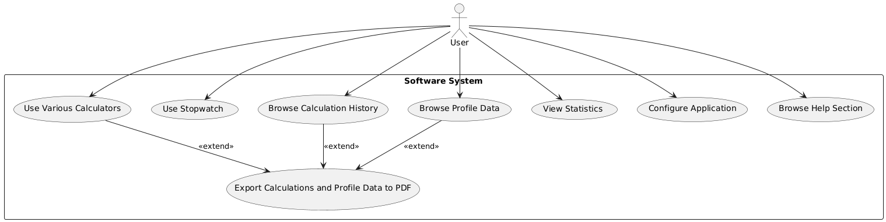

# Mobilní Fitness Aplikace

## Popis projektu

Mobilní fitness aplikace je určená pro uživatele, kteří chtějí zlepšit své fitness tréninky a sledovat svůj pokrok. Aplikace je dostupná na platformě Android a poskytuje řadu funkcí, včetně kalkulátorů pro tréninkové metody, stopky, historie tréninků, profil uživatele a statistiky. Je navržena tak, aby byla uživatelsky přívětivá a funkční, a to i bez připojení k internetu (offline).

## Hlavní funkce

- **Kalkulátory tréninkových metod:**
  - **Drop-set:** Snižování váhy a zvyšování opakování v cvičení typu drop-set.
  - **One-rep-max:** Výpočet maximální dosažitelné tréninkové váhy na jedno opakování.
  - **Pyramid:** Vytváření tréninkových plánů na základě pyramidové struktury.
  - **Reverse Pyramid:** Tréninkový plán s opačným pořadím než pyramidový.

- **Historie výpočtů:** Sledování předchozích tréninků a výkonů.

- **Stopky:** Měření času během tréninku s funkcemi startu, pauzy a resetování.

- **Profil uživatele:** Ukládání osobních údajů, zdravotních informací, měření a personalizovaných poznámek.

- **Statistiky:** Grafické zobrazení silových a zdravotních metrik a sledování pokroku.

- **Export do PDF:** Uložení tréninkových plánů a výsledků do PDF dokumentů.

- **Vícejazyčná podpora:** Přepínání mezi angličtinou a češtinou.

- **Nápověda:** Kontextová nápověda a obrázky pro lepší pochopení funkcí aplikace.

## Diagram tříd

Níže je uveden diagram tříd, který zobrazuje hlavní třídy a jejich vztahy v aplikaci:


## Use Case Diagram

Níže je uveden Use Case diagram, který ilustruje hlavní uživatelské scénáře a jejich interakce s aplikací:



## Instalace

1. Klonujte repozitář:
    ```bash
    git clone https://github.com/vas-uzivatel/jmeno-repozitare.git
    ```
2. Otevřete projekt v Android Studiu.
3. Nainstalujte závislosti a synchronizujte projekt s Gradle.
4. Spusťte aplikaci na zařízení nebo emulátoru.

## Použití

- **Kalkulátory:** Použijte kalkulátory pro přizpůsobení a optimalizaci tréninkových plánů.
- **Profil uživatele:** Zadejte a sledujte osobní a zdravotní údaje.
- **Historie:** Sledujte a analyzujte své předchozí tréninky.
- **Stopky:** Měřte čas během tréninků.
- **Statistiky:** Vizualizujte své silové a zdravotní metriky.

## Přispívání

Příspěvky jsou vítány! Pokud chcete přispět, postupujte následovně:

1. Forkněte repozitář.
2. Vytvořte novou větev (`git checkout -b novy-feature`).
3. Proveďte změny a commitujte (`git commit -am 'Přidání nové funkce'`).
4. Pushněte změny do svého forku (`git push origin novy-feature`).
5. Otevřete Pull Request.

## Licence

## Licence

Tento projekt je licencován pod MIT licencí. Případné použití, kopírování, modifikace, slučování, publikování, distribuce, sublicencování a/nebo prodej kopií tohoto softwaru jsou povoleny za následujících podmínek:

1. Výše uvedený copyrightový výpis a tento povolení výpis musí být zahrnuty ve všech kopiích nebo významných částech Softwaru.

2. SOFTWARE SE POSKYTUJE "TAK JAK JE", BEZ ZÁRUK JAKÉHOKOLIV DRUHU, VČETNĚ, ALE NEOMEZENĚ, ZÁRUK OBCHODOVATELNOSTI, VHODNOSTI PRO KONKRÉTNÍ ÚČEL A NEPORUŠENÍ. V ŽÁDNÉM PŘÍPADĚ NEBUDE AUTORSKÝ PRÁVCE NEBO VLASTNÍK PRÁV ODPOVĚDNÝ ZA JAKÉKOLI NÁROKY, ŠKODY NEBO JINOU ODPOVĚDNOST, AŤ UŽ V AKCI SMLUVNÍ, DELIKTNÍ NEBO JINAK, VYPLÝVAJÍCÍ Z NEBO V SOUVISLOSTI SE SOFTWAREM NEBO POUŽÍVÁNÍM NEBO JINÝMI JEDNÁNÍMI V SOFTWARE.


## Kontakt

Máte-li dotazy nebo zpětnou vazbu, kontaktujte mě na:

- Email: [vase-email@domena.com](mailto:oroszvision@gmail.com)
- GitHub: [https://github.com/vas-uzivatel](https://github.com/oroszvision)

---

Děkujeme, že používáte naši mobilní fitness aplikaci!
